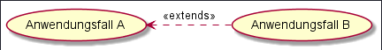
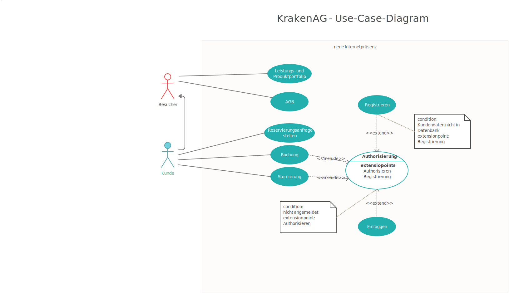

# Anwendungsfalldiagram | Use-Case-Diagram

## Table of Content

- [Intro](#intro)
- [Basics](#basics)
- [Beziehungen](#beziehungen)
- [Beispiele](#beispiele)

## Intro

Das Anwendungsfalldiagramm, oder auch Nutzfalldiagramm, wird genutzt um Anwendungsfälle und deren Akteure mit ihren jeweiligen Abhängigkeiten und Beziehungen darzustellen.

Es zählt zur Gruppe der Verhaltensdiagramme und stellt das **erwartete** Verhalten eines Systems dar. Das Diagramm soll dabei helfen, die Anforderungen an ein System sichtbar zu machen und zu definieren.
In einem Anwendungsfalldiagramm ist die Ablaufsreihenfolge daher nicht relevant und wird in anderen Diagrammen dargestellt.

## Basics

UML Anwendungsfalldiagramme werden verwendet um:

- Ziele der User-Interaktionen im System festzulegen.
- Funktionale Anforderungen an das System zu definieren.
- Das Umfeld um das System herum besser zu verstehen.

### Komponenten

Unter Komponenten verstehen wir die einzelnen Bausteine, die verwendet werden um das Diagramm in frage darzustellen.

- Actor

  - Benutzer der mit dem System interagiert
  - Kann Person / Organisation / System sein

- System
  - Eine Sequenz von Aktionen und Interaktionen
  - Kann auch als Szenario bezeichnet werden
  - Context für die Inter-/Aktionen
- Use-Case / Anwendungsfall
  - Werden als Ellipse dargestellt
  - Ist ein Vorgang, angestoßen durch einen Actor
  - Können Generalisiert / Vererbt werden

## Beziehungen

Beziehungen zwischen Akteuren und Use-Cases werden mit Verbindungslinien gekennzeichnet.

### Durchgezogene Linie

Eine durchgezogene Linie zwischen Akteur und Use-Case offenbart eine Beziehung zwischen beiden.

### Gestrichelte Linie

Beziehungen die durch eine gestrichelte Linie gekennzeichnet werden, können verschiedene Assoziationsarten darstellen:

#### include-Assoziation

Der Fall A, von dem die Linie ausgeht, bindet den Fall B, zu dem die Pfeilspitze zeigt mit ein.

#### extend-Assoziation

Der Fall A, auf den die Pfeilspitze zeigt, **kann** den Fall B, von dem die Linie ausgeht, unter bestimmten Bedingungen mit einbinden.

Da die Ausführung bei einer extend-Assoziation immer von einer Bedingung abhängig ist, muss diese Bedingung als Erweiterungspunkt / Extension-Point dargestellt werden.

Wie im oberen Bild zu sehen ist, wird bei einer Extension, die ja an eine Bedingung gebunden ist, diese als Notiz beigefügt.

## Beispiele

### Webseiten-Authentifizierung 🔒

#### Aufgabe: Datenkrake

Sie arbeiten für die Firma Datenkrake AG. Ihre Firma möchte von Ihnen ein ein Anwendungsfalldiagram für die neue Firmenseite. Sie bekommen folgende Informationen über geplante Funktionalität der Webseite:

- Jeder Besucher der die Seite aufruft, soll auf das Produktportfolio und auf die AGBs zugreifen können
- Besucher mit Kundenkonto sollen zusätzlich Reservierungsanfragen stellen können
- Besucher mit Kundenkonto sollen außerdem Zugriff auf Buchungen und Stornierungen haben, nachdem sie sich authorisiert (Angemeldet) haben. Falls kein Benutzerkonto vorhanden ist, soll außerdem die Möglichkeit geboten werden sich zu Registrieren.

Sie dürfen über die Aufgabenstellung hinaus weitere angemessene Annahmen selbst treffen.

#### Lösung Datenkrake

  
Lösung anzeigen

    
    

### Restaurant 🍽️

Zeitrahmen: 60 Minuten

#### Aufgabe: Restaurant - Kreative Aufgabe

Erstellen Sie ein Anwendungsfalldiagramm für typische Prozesse in einem Restaurant.️

- Mindestens 3 Akteure
- Mindestens 4 Anwendungsfälle
- Mindestens jeweils einen Anwendungsfall mit include und extend

Sie dürfen bei dieser Aufgabe Ihrer Kreativität freien lauf lassen und eigene Annahmen treffen. Mut zu Lücke! 🚀

#### Lösung Restaurant

  
Lösung anzeigen

    
    

